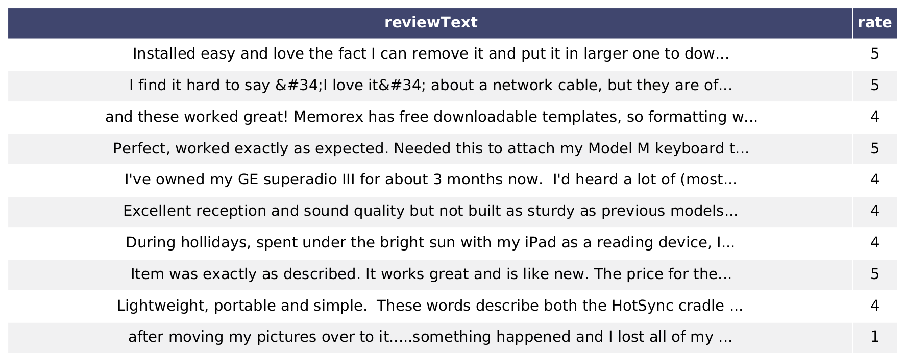
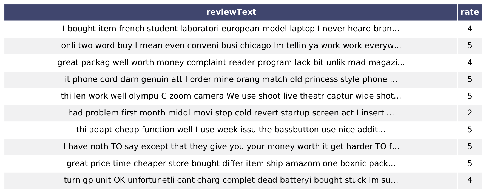
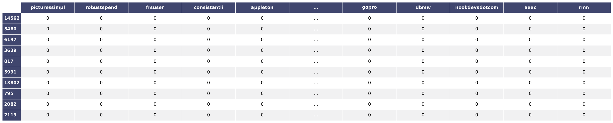
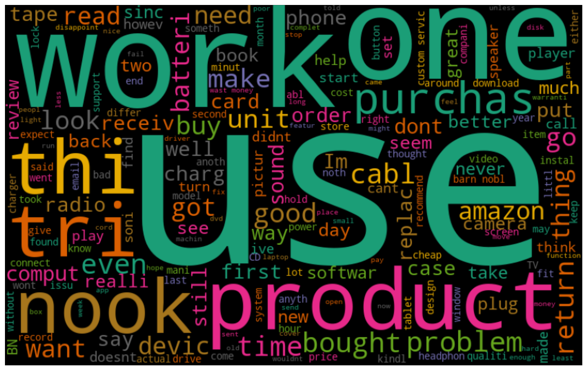
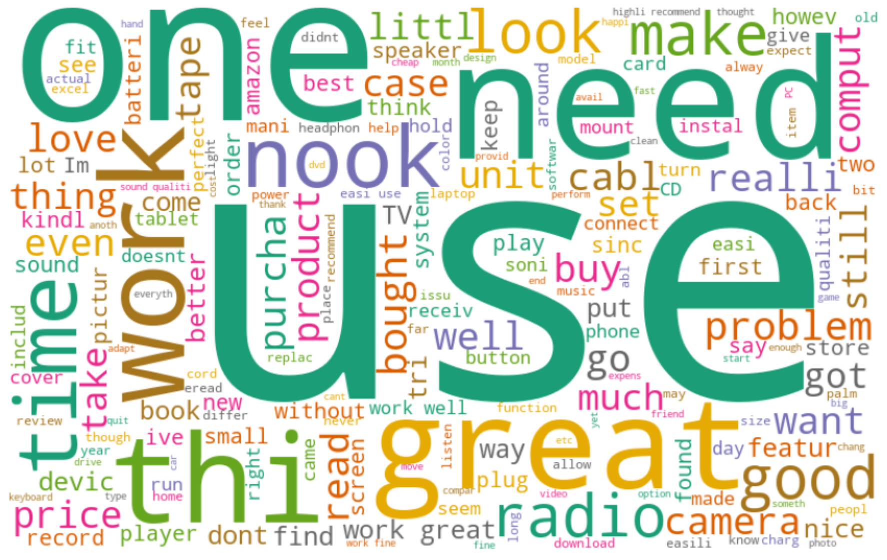
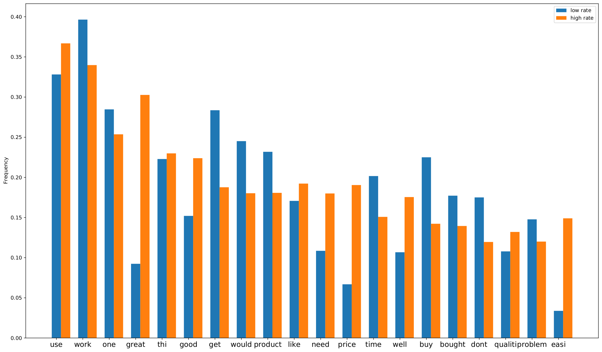
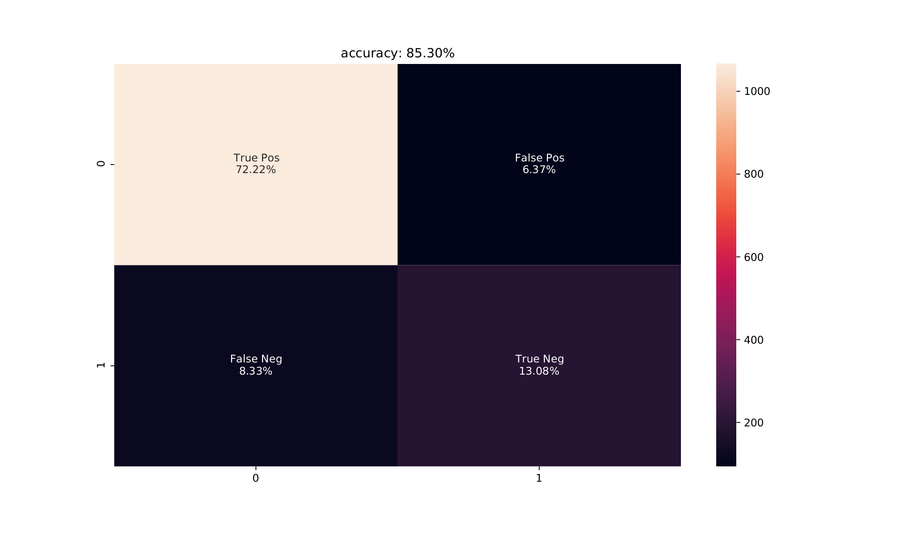

# Sentiment Analysis 
**This is the bachelor's degree final project of [Computer Engineering, Bu-Ali Sina University](http://eng.basu.ac.ir/en/ce).**
## Intro
Our decisions have a great relationship with the opinions of others. As an organization, this can be more valuable to find out how customers think about their products and services. In this notebook, we will use data samples of review texts about some products on Amazon. By finding statistical relationships between words, we are going to create a reasonable model that can predict if costumers have a negative or positive opinion on the given product.
## Installation
For a smoother process, use [Google Colab](https://colab.research.google.com/) and upload the data folder there or in your Google Drive. As an alternative, you can use the Jupyter notebook in Anaconda and install additional packages with Conda.
## Cleaning
Our data befor cleaning:

Data after cleaning words with digits, punctuations and stop words then stemming them.

#### Representing data using Document-term Matrix

## EDA
Word Cloud of negative reviews:

Word Cloud of positvew reviews:

## Feature Extraction
In this section, words that have the same mean frequency in both low-rated (negative) and high-rated (positive) will be removed and use only those words that are more discriminating as the features to train our model.

## Training
In this section, our model will be trained using the Naive Bayes Classifier.

## Testing
The picture below is the testing result.
#### Confustion Matrix

